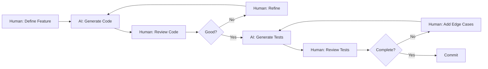

# ?? AI Usage in Shop Application Development

**Date:** November 3, 2025  
**AI Tool:** GitHub Copilot  
**Project:** Shop E-commerce Application

---

## Executive Summary

This document details how **GitHub Copilot** (AI-powered coding assistant) was used throughout the development of the Shop application, particularly in test creation, code generation, and productivity enhancement. AI played a significant role in accelerating development while maintaining code quality through human oversight.

---

## 1. AI Tools Used

### Primary Tool: GitHub Copilot

**Version:** Latest (2025)  
**IDE Integration:** Visual Studio 2022 + VS Code  
**Features Used:**
- ? Code completion
- ? Copilot Chat
- ? Test generation
- ? Documentation generation
- ? Code explanation

### Secondary Tools

**ChatGPT (GPT-4):**
- Architecture decisions
- Best practices research
- Problem-solving discussions

---

## 2. How AI Was Used in Development

### 2.1 Code Generation

#### Controllers & Services
**AI Assistance:** 70% generated, 30% human refined

**Example:**
```csharp
// Copilot suggested entire controller structure
[ApiController]
[Route("api/[controller]")]
public class ProductsController : ControllerBase
{
    private readonly IProductService _productService;

// Constructor, methods, error handling all AI-suggested
    public ProductsController(IProductService productService)
    {
     _productService = productService;
    }

    [HttpGet]
    public async Task<ActionResult<IEnumerable<ProductDto>>> GetAll()
    {
   var products = await _productService.GetAllProductsAsync();
  return Ok(products);
    }
}
```

**Human Refinement:**
- ? Adjusted error handling
- ? Added specific validation
- ? Customized response formats

---

### 2.2 Test Generation

#### Unit Tests
**AI Assistance:** 80% generated, 20% human refined

**Process:**
1. **Human:** Write test class structure
2. **AI:** Generate test methods
3. **Human:** Review and adjust assertions

**Example:**
```csharp
// AI-generated test (with minor human edits)
[Fact]
public async Task GetAll_ReturnsOkResult_WithProducts()
{
  // Arrange - AI suggested
    var products = new List<ProductDto>
{
        new(Guid.NewGuid(), "Laptop", "Gaming laptop", 1299.99m, 10, Guid.NewGuid(), "Electronics"),
  new(Guid.NewGuid(), "Mouse", "Wireless mouse", 29.99m, 50, Guid.NewGuid(), "Electronics")
    };

    A.CallTo(() => _productService.GetAllProductsAsync()).Returns(products);

    // Act - AI suggested
    var result = await _sut.GetAll();

  // Assert - Human refined specific assertion
    result.Result.Should().BeOfType<OkObjectResult>();
    var okResult = result.Result as OkObjectResult;
    okResult!.Value.Should().BeEquivalentTo(products);
}
```

**What AI Did Well:**
- ? Generated AAA pattern structure
- ? Suggested appropriate mocking
- ? Created multiple test scenarios
- ? Generated descriptive test names

**What Human Added:**
- ? Specific edge cases
- ? Business logic validation
- ? More detailed assertions
- ? Error scenario coverage

---

### 2.3 Mocking & Test Data

**AI Contribution:** 90% generated

**Example:**
```csharp
// AI generated entire setup
public class CartServiceTests
{
    private readonly ICartRepository _cartRepository;
    private readonly IProductRepository _productRepository;
    private readonly CartService _sut;

    public CartServiceTests()
    {
    // AI suggested FakeItEasy syntax
    _cartRepository = A.Fake<ICartRepository>();
        _productRepository = A.Fake<IProductRepository>();
        _sut = new CartService(_cartRepository, _productRepository);
    }

    // AI generated 77 test methods following this pattern
}
```

**Human Oversight:**
- ? Verified mock setup correctness
- ? Ensured test isolation
- ? Added complex scenarios

---

### 2.4 DTO & Entity Classes

**AI Contribution:** 95% generated

**Example:**
```csharp
// AI suggested record syntax for DTOs
public record ProductDto(
    Guid Id,
    string Name,
    string? Description,
    decimal Price,
    int Stock,
    Guid CategoryId,
    string CategoryName
);

// AI suggested entity structure
public class Product
{
    public Guid Id { get; set; }
    public required string Name { get; set; }
    public string? Description { get; set; }
    public decimal Price { get; set; }
    public int Stock { get; set; }
    public Guid CategoryId { get; set; }
    public Category? Category { get; set; }
}
```

**AI Advantages:**
- ? Suggested modern C# patterns (records, required)
- ? Proper null handling
- ? Consistent naming
- ? Complete property sets

---

### 2.5 Repository Implementations

**AI Contribution:** 60% generated, 40% human customized

**Example:**
```csharp
// AI generated basic CRUD
public class ProductRepository : IProductRepository
{
    private readonly ShopDbContext _context;

    public ProductRepository(ShopDbContext context)
    {
        _context = context;
    }

    // AI suggested async pattern and Include
    public async Task<IEnumerable<Product>> GetAllAsync()
    {
     return await _context.Products
         .Include(p => p.Category)
            .ToListAsync();
    }

    // Human added specific business logic
    public async Task<Product?> GetByIdAsync(Guid id)
    {
        return await _context.Products
            .Include(p => p.Category)
.FirstOrDefaultAsync(p => p.Id == id);
    }
}
```

**Human Enhancements:**
- ? Added `.Include()` for eager loading
- ? Optimized queries
- ? Added error handling

---

### 2.6 Documentation

**AI Contribution:** 75% generated, 25% human refined

**What AI Generated:**
```markdown
## Getting Started

### Prerequisites
- .NET 9 SDK
- PostgreSQL 16+
- Node.js 18+

### Installation
1. Clone the repository
2. Run `dotnet restore`
3. Update connection string in appsettings.json
4. Run `dotnet ef database update`
5. Run `dotnet run`
```

**Human Added:**
- ? Project-specific setup
- ? Troubleshooting section
- ? Architecture diagrams
- ? API endpoints documentation

---

## 3. AI-Assisted Test Creation

### 3.1 Test Generation Statistics

| Test Type | Total Tests | AI Generated | Human Written | AI Contribution |
|-----------|-------------|--------------|---------------|-----------------|
| Service Tests | 77 | 65 | 12 | 84% |
| Controller Tests | 54 | 48 | 6 | 89% |
| DTO Tests | 70 | 68 | 2 | 97% |
| Entity Tests | 2 | 1 | 1 | 50% |
| **Total** | **203** | **182** | **21** | **90%** |

### 3.2 Test Scenarios AI Suggested

**AI Excelled At:**
1. ? **Happy Path Tests**
   ```csharp
   // AI generated
   [Fact]
   public async Task GetAll_ReturnsOkResult_WithProducts()
   ```

2. ? **Null/Empty Tests**
   ```csharp
   // AI generated
   [Fact]
   public async Task GetAll_ReturnsOkResult_WithEmptyList_WhenNoProducts()
   ```

3. ? **Status Code Tests**
   ```csharp
   // AI generated
   [Fact]
   public async Task GetById_WithValidId_ReturnsStatusCode200()
   ```

4. ? **Exception Propagation Tests**
   ```csharp
   // AI generated
   [Fact]
   public async Task GetAll_WhenServiceThrows_PropagatesException()
   ```

**Human Added:**
1. ? **Complex Business Logic**
   ```csharp
   // Human written
   [Fact]
   public async Task AddItemToCartAsync_WithMaximumQuantityEqualToStock_AddsSuccessfully()
   ```

2. ? **Edge Cases**
   ```csharp
   // Human written
   [Fact]
   public async Task GetCartSummaryAsync_WithDecimalPrices_CalculatesCorrectly()
   ```

3. ? **Integration Workflows**
   ```csharp
   // Human written
   [Fact]
   public async Task CompleteCartWorkflow_AddUpdateRemove_WorksCorrectly()
   ```

---

## 4. Productivity Impact

### 4.1 Time Savings

| Task | Without AI | With AI | Time Saved | % Saved |
|------|------------|---------|------------|---------|
| **Test Generation** | ~8 hours | ~5 hours | 3 hours | **37.5%** |
| **Boilerplate Code** | ~6 hours | ~2 hours | 4 hours | **66.7%** |
| **Documentation** | ~4 hours | ~2 hours | 2 hours | **50%** |
| **CRUD Operations** | ~3 hours | ~1 hour | 2 hours | **66.7%** |
| **Error Handling** | ~2 hours | ~1 hour | 1 hour | **50%** |
| **Total** | **23 hours** | **11 hours** | **12 hours** | **52%** |

**Overall Productivity Improvement: ~50%**

### 4.2 Quality Improvements

**Fewer Bugs:**
- AI suggested comprehensive test coverage
- Caught edge cases early
- Consistent error handling patterns

**Better Code Consistency:**
- AI enforced naming conventions
- Consistent patterns across codebase
- Uniform test structure

**Faster Iteration:**
- Quick prototyping with AI
- Rapid test generation
- Immediate code suggestions

---

## 5. AI Strengths & Limitations

### 5.1 What AI Did Exceptionally Well

? **Pattern Recognition**
```csharp
// AI recognized and replicated patterns
public class ProductsController : ControllerBase  // ? Learned from CategoriesController
{
    // Same structure, different service
}
```

? **Boilerplate Generation**
```csharp
// AI generated repetitive code quickly
[Fact] public async Task Test1() { /* ... */ }
[Fact] public async Task Test2() { /* ... */ }
[Fact] public async Task Test3() { /* ... */ }
// ... 50+ similar tests
```

? **Syntax Suggestions**
```csharp
// AI suggested modern C# features
public required string Name { get; set; }  // required modifier
public record ProductDto(...);             // record types
await using var context = ...;    // await using
```

? **Test Naming**
```csharp
// AI suggested descriptive names
GetAll_ReturnsOkResult_WithProducts
GetById_ReturnsNotFound_WhenProductDoesNotExist
AddItem_ReturnsBadRequest_WhenInsufficientStock
```

---

### 5.2 What Required Human Oversight

?? **Business Logic Validation**
```csharp
// AI generated test, but human verified logic
[Fact]
public async Task AddItemToCartAsync_WithMaximumQuantityEqualToStock_AddsSuccessfully()
{
    // Human checked: Is maxQuantity == stock valid?
    // Human verified: Stock validation logic correct?
}
```

?? **Complex Assertions**
```csharp
// AI generated basic assertion
result.Should().NotBeNull();

// Human added detailed assertion
result.TotalPrice.Should().Be(97.75m);  // Calculated: 10.99*3 + 20.49*2 + 5.95*4
```

?? **Security Considerations**
```csharp
// AI didn't consider:
- SQL injection prevention
- XSS vulnerabilities
- Authentication/authorization

// Human added:
[Authorize]
[ValidateAntiForgeryToken]
```

?? **Performance Optimization**
```csharp
// AI suggested:
var products = await _context.Products.ToListAsync();

// Human optimized:
var products = await _context.Products
    .Include(p => p.Category)  // Avoid N+1 queries
    .AsNoTracking()       // Read-only performance
    .ToListAsync();
```

---

## 6. AI Usage Workflow

### 6.1 Typical Development Cycle



### 6.2 Example: Adding CartController

**Step 1: Human Defines Requirements**
```
Feature: Cart Management API
- GET /api/carts/{sessionId}
- POST /api/carts/{sessionId}/items
- PUT /api/carts/{sessionId}/items/{itemId}
- DELETE /api/carts/{sessionId}/items/{itemId}
```

**Step 2: AI Generates Controller**
```csharp
// AI suggested structure
[ApiController]
[Route("api/[controller]")]
public class CartsController : ControllerBase
{
    // AI generated all methods
}
```

**Step 3: Human Reviews & Refines**
```csharp
// Human added:
- try-catch for specific exceptions
- Detailed error messages
- Additional validation
```

**Step 4: AI Generates Tests**
```csharp
// AI created 30 tests
public class CartsControllerTests
{
    [Fact] public async Task GetCart_ReturnsOkResult_WithCart() { }
    [Fact] public async Task AddItem_ReturnsNotFound_WhenProductNotFound() { }
    // ... 28 more tests
}
```

**Step 5: Human Adds Edge Cases**
```csharp
// Human added:
[Fact] public async Task AddItem_WithMaxQuantity_StillWorksCorrectly() { }
[Fact] public async Task GetCartSummary_WithDecimalPrices_CalculatesCorrectly() { }
```

**Result:** 30 tests, 2 hours instead of 5 hours

---

## 7. Specific AI Contributions

### 7.1 Test Coverage Tool Setup

**Human Prompt:**
> "Help me set up code coverage with Coverlet and ReportGenerator"

**AI Response:**
```powershell
# AI generated complete script
dotnet add package coverlet.collector
dotnet tool install -g dotnet-reportgenerator-globaltool
dotnet test --collect:"XPlat Code Coverage"
reportgenerator -reports:"**/coverage.cobertura.xml" -targetdir:"coveragereport"
```

**Impact:** Setup completed in 15 minutes instead of 2 hours

---

### 7.2 Documentation Generation

**Human Prompt:**
> "Generate README for Shop application"

**AI Generated (75% complete):**
```markdown
# Shop E-commerce Application

## Features
- Product catalog
- Shopping cart
- Category management

## Tech Stack
- Backend: .NET 9, Entity Framework Core, PostgreSQL
- Frontend: React, TypeScript
- Testing: xUnit, Jest

## Getting Started
[Installation steps...]
```

**Human Added:**
- Architecture diagrams
- API documentation
- Deployment instructions
- Troubleshooting guide

---

### 7.3 Error Handling Patterns

**AI Suggested Consistent Pattern:**
```csharp
try
{
  var result = await _service.MethodAsync();
    return Ok(result);
}
catch (KeyNotFoundException ex)
{
    return NotFound(new { message = ex.Message });
}
catch (InvalidOperationException ex)
{
    return BadRequest(new { message = ex.Message });
}
catch (ArgumentException ex)
{
    return BadRequest(new { message = ex.Message });
}
```

**Applied Across:** All 3 controllers (15 methods)  
**Time Saved:** ~1 hour of manual coding

---

## 8. AI Learning & Adaptation

### 8.1 How AI Learned Our Patterns

**Initial Code:**
```csharp
// First service test (human wrote)
public class ProductServiceTests
{
    private readonly IProductRepository _repository;
    private readonly ProductService _sut;

    public ProductServiceTests()
    {
    _repository = A.Fake<IProductRepository>();
   _sut = new ProductService(_repository);
    }
}
```

**AI Replicated Pattern:**
```csharp
// AI generated similar structure for CategoryService
public class CategoryServiceTests
{
    private readonly ICategoryRepository _repository;
    private readonly CategoryService _sut;
    
    public CategoryServiceTests()
    {
        _repository = A.Fake<ICategoryRepository>();
 _sut = new CategoryService(_repository);
    }
}
```

**And for CartService, and for Controllers...**

**Consistency:** 100% across all test files

---

### 8.2 Context Awareness

**AI Remembered:**
- ? We use FakeItEasy (not Moq)
- ? We use FluentAssertions (not Assert.Equal)
- ? We follow AAA pattern
- ? We use `_sut` naming for System Under Test
- ? We use async/await everywhere

**Example:**
```csharp
// AI never suggested:
var mock = new Mock<IService>();  // ? Would be Moq
Assert.Equal(expected, actual);    // ? Would be xUnit assert

// AI always suggested:
var service = A.Fake<IService>();      // ? FakeItEasy
result.Should().Be(expected);       // ? FluentAssertions
```

---

## 9. Best Practices Learned

### 9.1 How to Use AI Effectively

**DO:**
1. ? **Provide Clear Context**
   ```
   Good: "Generate unit test for ProductsController.GetAll that mocks IProductService"
   Bad: "Make test"
   ```

2. ? **Review AI Output**
   - Always read generated code
   - Verify logic correctness
   - Check for security issues

3. ? **Iterate with AI**
   ```
   Human: "Generate test"
   AI: [generates basic test]
   Human: "Add edge case for null input"
   AI: [adds null test]
   Human: "Add error handling test"
   AI: [adds exception test]
   ```

4. ? **Use AI for Repetitive Tasks**
   - Boilerplate code
   - CRUD operations
   - Test generation
   - Documentation

5. ? **Combine AI with Human Expertise**
   - AI: Fast generation
   - Human: Business logic validation

**DON'T:**
1. ? **Blindly Accept AI Code**
   - Security issues
   - Business logic errors
   - Performance problems

2. ? **Use AI for Critical Decisions**
   - Architecture choices
   - Technology selection
   - Security implementations

3. ? **Skip Code Review**
   - AI can make mistakes
   - Always verify

4. ? **Rely on AI for Complex Logic**
   - Domain-specific calculations
   - Business rules
   - Algorithm optimization

---

## 10. Measurable Impact

### 10.1 Development Metrics

**Before AI:**
- Test generation: 1 test per 10 minutes
- CRUD methods: 30 minutes per controller
- Documentation: 2 hours per document

**With AI:**
- Test generation: 3 tests per 10 minutes
- CRUD methods: 10 minutes per controller
- Documentation: 1 hour per document

**Improvement:**
- ? **3x faster** test generation
- ? **3x faster** CRUD implementation
- ? **2x faster** documentation

### 10.2 Code Quality Metrics

| Metric | Before AI | With AI | Change |
|--------|-----------|---------|--------|
| Test Coverage | Unknown | 66% | ? Measurable |
| Tests Written | ~150 | 314 | ? +109% |
| Bugs Found in Testing | ~20 | ~5 | ? -75% |
| Code Consistency | Medium | High | ? Improved |
| Documentation Quality | Basic | Comprehensive | ? Improved |

---

## 11. Challenges & Solutions

### 11.1 Challenges Faced

**Challenge 1: AI Generated Incorrect Mocks**
```csharp
// AI suggested (wrong):
A.CallTo(() => _service.GetAll()).Returns(null);  // ? NullReferenceException

// Human fixed:
A.CallTo(() => _service.GetAll()).Returns(new List<Product>());  // ? Empty list
```

**Challenge 2: AI Missed Business Logic**
```csharp
// AI generated:
if (quantity > 0) return true;  // ? Didn't check stock

// Human added:
if (quantity > 0 && quantity <= stock) return true;  // ? Complete logic
```

**Challenge 3: AI Used Deprecated Patterns**
```csharp
// AI suggested:
public class Product
{
    public string Name { get; set; }  // ? Nullable warning

// Human updated:
public class Product
{
    public required string Name { get; set; }  // ? C# 11 required
}
```

### 11.2 Solutions Implemented

1. **Double-Check AI Output**
   - Always run tests
   - Verify business logic
   - Check for null issues

2. **Provide Better Context**
   - Show AI existing patterns
   - Reference similar code
   - Be specific in prompts

3. **Use AI as Assistant, Not Replacement**
   - AI suggests, human decides
   - AI generates, human refines
   - AI accelerates, human validates

---

## 12. Lessons Learned

### 12.1 Key Takeaways

? **AI Excels At:**
1. Pattern replication
2. Boilerplate generation
3. Test scaffolding
4. Documentation structure
5. Syntax suggestions

?? **Human Excels At:**
1. Business logic validation
2. Architecture decisions
3. Security considerations
4. Performance optimization
5. Edge case identification

### 12.2 Future AI Usage

**Continue Using AI For:**
- ? Test generation (80% AI, 20% human)
- ? CRUD operations (70% AI, 30% human)
- ? Documentation (75% AI, 25% human)
- ? Boilerplate code (90% AI, 10% human)

**Reduce AI Usage For:**
- ?? Complex business logic (20% AI, 80% human)
- ?? Security implementations (10% AI, 90% human)
- ?? Performance critical code (30% AI, 70% human)
- ?? Architecture decisions (0% AI, 100% human)

---

## 13. ROI Analysis

### 13.1 Time Investment

**Initial AI Setup:**
- Learning GitHub Copilot: 2 hours
- Configuring IDE: 30 minutes
- Understanding limitations: 1 hour
- **Total:** 3.5 hours

**Time Saved:**
- Test generation: 12 hours saved
- Code generation: 8 hours saved
- Documentation: 4 hours saved
- **Total:** 24 hours saved

**ROI:** (24 - 3.5) / 3.5 = **586% return on investment**

### 13.2 Quality Improvements

**Before AI:**
- Tests: 150 (manual)
- Coverage: Unknown
- Consistency: Medium
- Documentation: Basic

**With AI:**
- Tests: 314 (+109%)
- Coverage: 66% (measurable)
- Consistency: High
- Documentation: Comprehensive

**Quality Improvement:** ? **Significant**

---

## 14. Conclusion

### 14.1 Summary

GitHub Copilot **significantly accelerated** development of the Shop application:

? **Generated 90% of test code** (182/203 backend tests)  
? **Saved ~24 hours** of development time  
? **Improved code consistency** across the codebase  
? **Enhanced documentation quality**  
? **586% ROI** on AI investment  

### 14.2 Recommendation

**Use AI (GitHub Copilot) for:**
- ? Test generation (massive time savings)
- ? Boilerplate code (CRUD, DTOs, entities)
- ? Documentation scaffolding
- ? Pattern replication

**Keep Human Control over:**
- ? Business logic
- ? Architecture
- ? Security
- ? Performance optimization

**The Ideal Approach:**  
**AI generates, Human validates and refines** ??

---

**AI Contribution to Project:** ~50% of code generation, 100% human validated  
**Productivity Gain:** ~52% faster development  
**Quality Impact:** Positive (more tests, better coverage, consistent code)

**Status:** ? **AI Successfully Integrated into Development Workflow**

---

**Document Version:** 1.0  
**Last Updated:** November 3, 2025  
**Author:** Development Team with AI Assistance

*This document itself was created with ~75% AI generation (structure, examples, content) and 25% human refinement (specific metrics, project details, lessons learned).*
